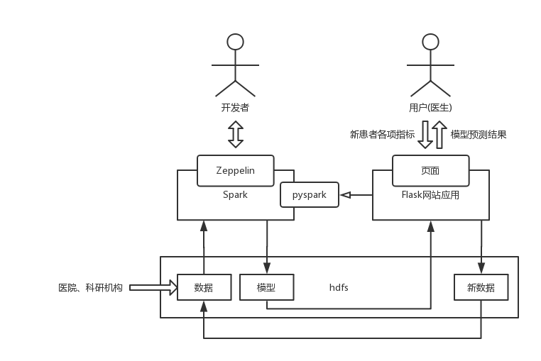
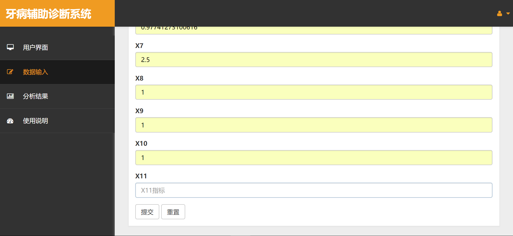
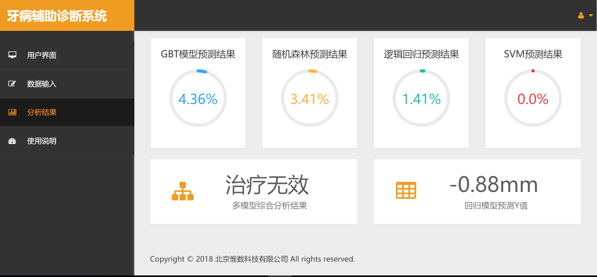
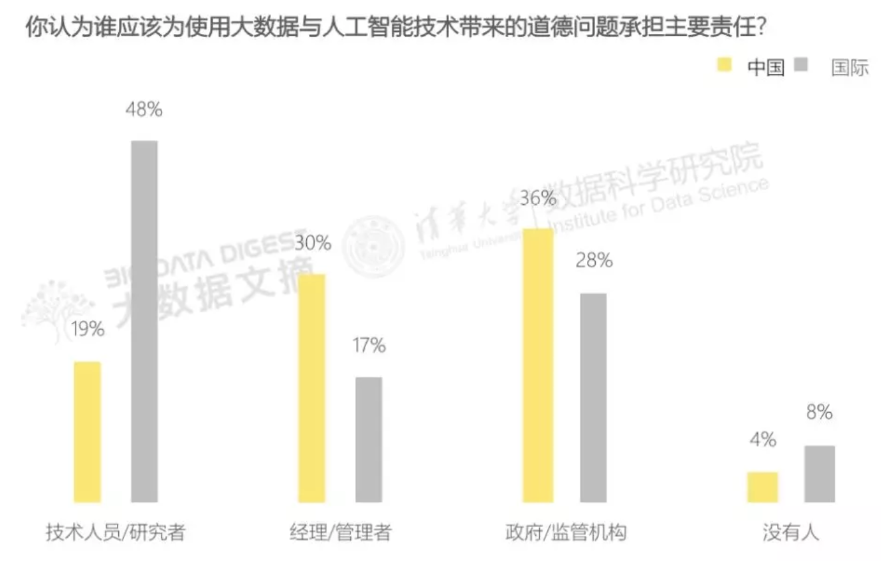
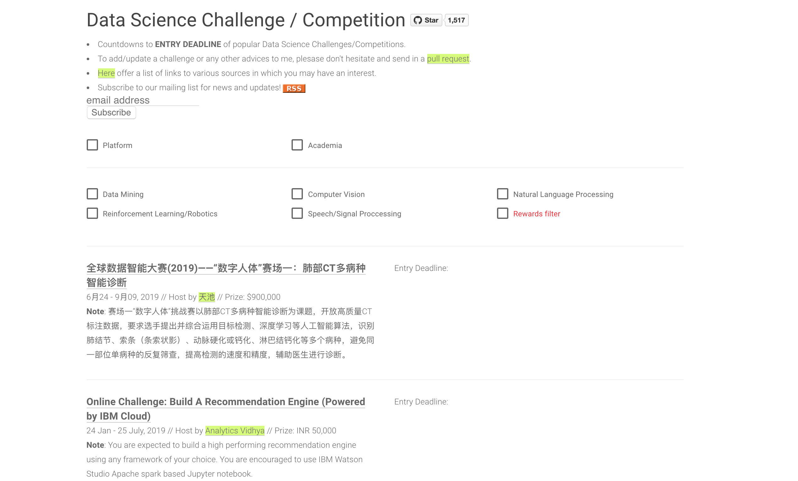
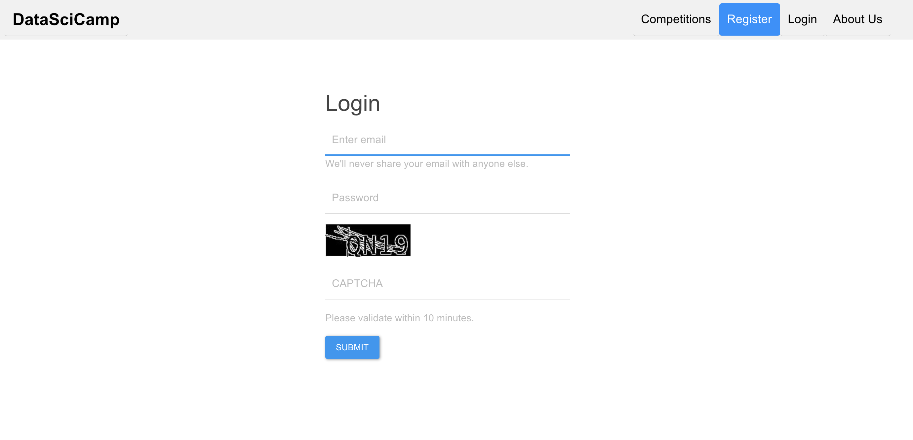
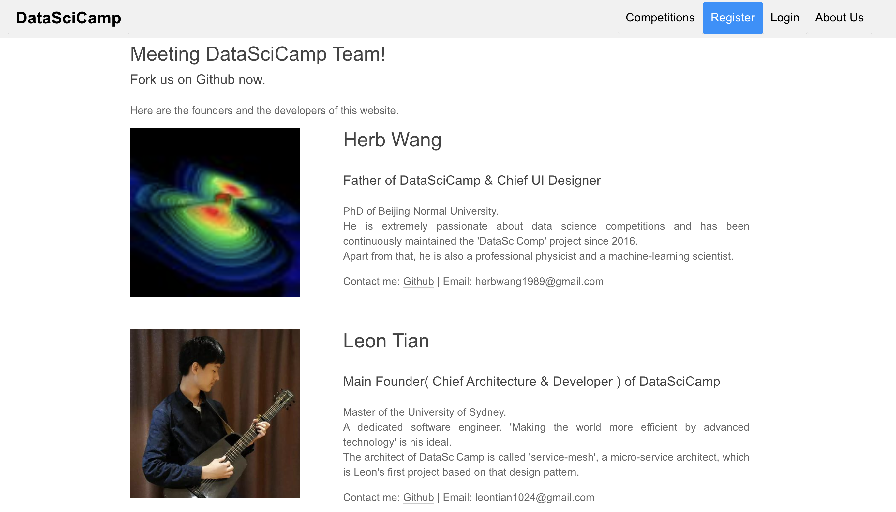
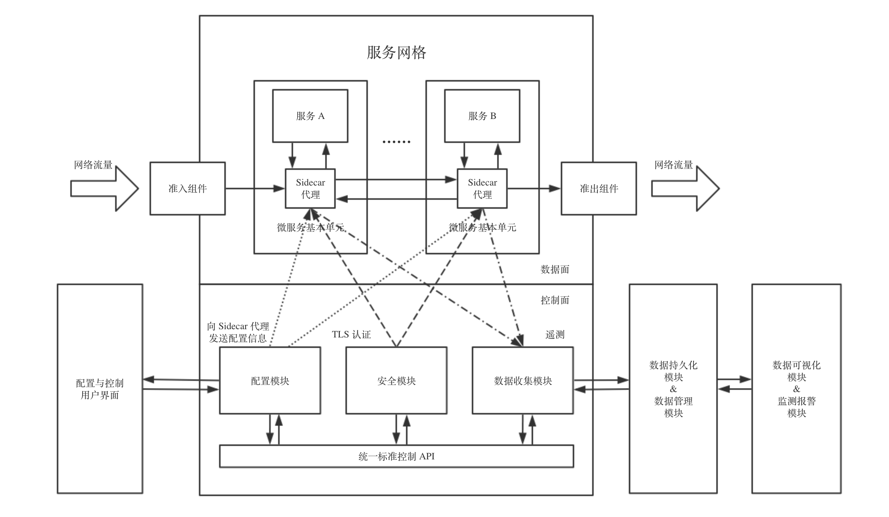
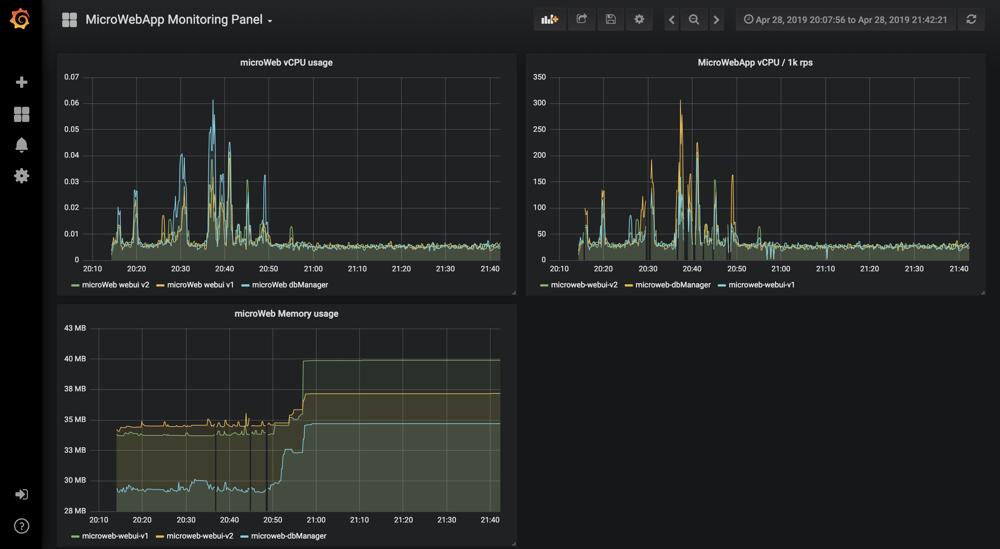
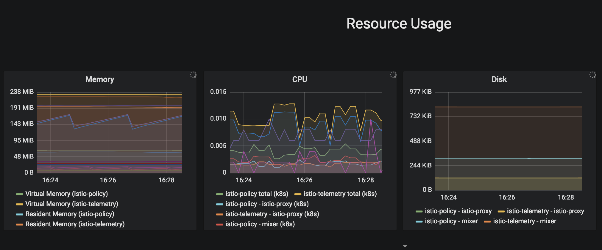

# List of My Projects

## Contact Me!
- Xinyao Tian ( Richard Tian )
- mobile number(AU): (+61) 0457 512 404
- mobile number(CH): (+86) 13311369059
- Email: richardtian1024@gmail.com
- CSDN technical Blog: https://blog.csdn.net/weixin_38070561
- Zhihu technical Blog: https://www.zhihu.com/people/winchester-26/activities
- Github: https://github.com/XinyaoTian

## The Assisted Diagnosis IT System of Periodontal Disease 
(Cooperate with a Doctor from Peking University)

### Keywords
>Project keywords: BigData, Machine Learning, Information System, Web application

>Technical keywords: Zeppelin, Spark, pySpark, Flask, Linux, DevOps

### A Brief Introduction of the Project

近年来，大数据的跨领域研究受到热烈追捧。本项目由北京大学一名研究牙周病的医学博士发起，提供近 20 年来其部门医师出诊时通过临床诊断所收集到的 170 余万条(经过脱敏)真实牙周病病例的牙位点数据( 共 27 个维度 )，并由我所带领的团队负责机器学习的训练建模部分( 包括数据清洗、预处理、可视化、机器学习建模、模型调参及验证、模型导出及持久化 )的模型构建工作，以及开发一个具有“输入新的病人数据并预测其牙周病严重程度”功能的 Web 服务信息系统原型。

### Mainly Description of the Project

技术选型方面，模型训练平台我选用的是 Zeppelin，配合底层的 Spark 和 pyspark 工具库可以达到非常优秀的可视化和实时交流协作的目的。几乎每次跑完一个模型，我都可以立刻使用 Zeppelin 将网格搜索交叉验证的结果向博士在线汇报，这种频繁的“汇报-改进”模式能够及时发现问题并立刻作出修改，极大地避免了“开发和需求偏差过大”的风险。Web 服务方面，由于是开发演示版 Demo ，对性能要求不高，且需求较为明确，因此本人选用基于 Python 的 Flask 框架，简单易用，加快开发进度。Web 服务通过 pyspark 调用存储在 hdfs 上训练好的模型来实现“新值预测”的功能。

### Project Outcomes

Design of the System Architecture

Project Show - the input web page of patients' info

Project Show - the web page of predicted results by the ML models

### Project Achievements

项目完成后，博士和公司领导对我的工作给予高度评价；我开发的 Web 服务演示版在答辩时获得了专家组老师们的青睐，有一名专家甚至多次输入了牙位点的各种数值，并将预测结果与其实际临床经验对比，发现仅有微小出入，但是系统的诊断时间只有 5 秒，是传统诊断流程所耗费时间的百分之一，于是便对本系统和机器学习模型产生了浓厚兴趣。

作为本项目的负责人，我还荣幸地成为了该博士论文的作者之一。该论文已投稿给国内某顶级医疗领域期刊，有望在明年发表。

### Project References
[Source Code of web application part](https://github.com/XinyaoTian/dentist_demo)

[Project Delivery PPT (in Chinese) ](https://github.com/XinyaoTian/project_introduction/blob/master/ppt/pku_dentist/%E5%A4%A7%E6%95%B0%E6%8D%AE%E5%AE%9E%E8%B7%B5%E8%AF%BE%E7%A8%8B%E5%B1%95%E7%A4%BA%E7%89%99%E5%91%A8%E7%97%85%E6%B2%BB%E7%96%97%E6%96%B9%E6%A1%88%E7%96%97%E6%95%88%E9%A2%84%E6%B5%8B.pptx?raw=true)

## Top Data Team Building Panorama Report of the Year 2018
(Cooperate with the Institute of Data Science, Tsinghua University)

### Keywords

>Project Keywords: Data Analysing, Web Crawler, Data Visualization

>Technical Keywords: Scrapy, Pandas, Matplotlib, Hdfs, MongoDB

### A Brief Introduction of the Project

本项目及其发布会由清华大学数据科学研究院主办，《大数据文摘》协办。其团队组成主要由以下四个团队所组成：负责获取数据的“爬虫团队”，负责分析数据的“分析团队”，负责撰写文章及采访各位业内大牛的“媒体团队”和负责版面设计、印刷及发布会的“设计团队”。团队总人数多达数十人。

### Mainly Description of the Project

在该项目中，我同时担任了“分析团队”的主要负责人和“爬虫团队”的主要负责人。在“爬虫团队”中，由于该团队总人数达 13 人之多，为了统一数据格式、避免数据过于混乱，我主要承担了拟定“爬虫数据获取维度及规范”的工作，用于规范数据格式并使之符合发布需求；同时，我还单独负责获取“智联招聘”网站上有关数据岗位的职位信息。在“分析团队”中，结合获取到的数据，我负责选定分析工具( 选用 pandas 工具库，并自己对于 jieba 做了一层封装供组员快速使用 )、组织并协调分析团队的成员、拟定哪些维度需要分析并明确分析目的；同时我还与“设计团队”的成员多次开会，讨论设计方案的可行性、明确“分析团队”的分析结果输出格式等。

### Project Outcomes

Cover Page of the Report

Data Analysing - in Public View: Who will be responsible for the moral problems with AI and Big Data?

Data Analysing - Comparison of the main demand of skills between Chinese universities and companies

### Project Achievements

在团队全体成员连续三周的努力下，“ 2018 年度顶级数据团队建设全景报告” 于 2018 年 9 月 26 日在清华大学数据科学研究院报告厅成功发布，发布会现场气氛热烈。在本报告发布后，包括“机器之心”、“数据堂”、“数据派”、“上海大数据联盟”、“数字人才”( 当然也包括“大数据文摘” )在内的数十个公众号( 包括十余个百万量级的公众号 )在当日或次日也立即进行了转载；科技圈公众号被同一份报告如此大规模“屠版”的现象实属罕见。

### Project References
[合作媒体发布-大数据文摘](https://mp.weixin.qq.com/s/FSgPY1Q0qBtL8bJQ1GYb-A)

[“清华2018顶级数据团队建设全景报告-摘要版”  附“精华版”下载链接](https://t.cj.sina.com.cn/articles/view/6105753431/16bee675701900bt98)

ps: If you're interested in content of the report, please google the keyword "2018 年度顶级数据团队建设全景报告".
There are many Chinese medias reported our research.

## 北京师范大学 - "DataSciCamp" 数据科学家信息收集门户网站

>项目关键词: Web 设计与开发、数据科学、微服务架构

[DataSciCamp 网站首页](https://iphysresearch.github.io/DataSciComp/)

### 项目简介

本项目的落地产品是可供高校老师和同学们获取和共享最新的竞赛信息、并分享解决思路的门户网站。

项目创新点主要集中在利用 "微服务架构" 实现了传统 Web 项目的开发。、

### 项目经历

本项目于 2019 年 7 月 29 日立项。
截止 2019 年 9 月 20 日，我与我的团队使用微服务架构已经完成了网站绝大部分功能的设计与实现。
使用微服务架构，我们不仅极大地简化了网站的部署和运维工作，并且协作成本极大降低，沟通效率大幅度提升。
本项目的最终版本"DataSciCamp 1.0"预计将于 2019 年 10 月 1 日正式上线，届时欢迎各位老师和同学进入新版本，感受全新的用户体验。

### 项目成果及展示

DataSciCamp 测试版本-网站首页

DataSciCamp 新版本-登陆页面

DataSciCamp 主要贡献者名单

### 项目后续及影响

本项目为 Github 上的开源项目。截止目前，我们已经收获了 1500 多个 Stars 以及无数老师、学生和软件开发者们的热情反馈。

### 中国科学院软件研究所 - 基于 Kubernetes 的微服务监控数据可视化项目

> 项目关键词: 基础架构、微服务架构、运行监测系统

[中科院软件所"微服务小组" Github 组织主页链接](https://github.com/iscas-microservice-team)

### 项目简介

本项目组的主要工作是基于 Kubernetes 研究及开发某互联网企业的自用云服务平台( 类似“阿里云”、“腾讯云”等 )并按时交付。作为项目组的一员，我主要负责研究“微服务架构如何应用在 Kubernetes 集群”以及设计实现 Docker 容器监控云件及模块。

### 项目经历

在该项目的研究中，我查阅并翻译了数篇外文博客及外文开发文档，在自己得到提高的同时也为中文开发社区贡献了便利和价值( 翻译文章见: [Envoy 、 Nginx 和 HAProxy，微服务中的通信代理该如何抉择? 翻译自英文博客](https://zhuanlan.zhihu.com/p/53470343) ，首发于掘金翻译计划 )。

技术选型方面，我使用了“服务网格(  Service Mesh )”架构来代替较为流行的“ Spring Cloud 框架”进行监控模块的设计。
目前该模块的进度已经可以监测到每一个微服务之间的调用关系( 基于 Istio 的 Sidecar 模式和 L4 、 L7 代理 )，以及可视化展现多种常用监测指标( 如 CPU 利用率、网络延迟等，基于 Prometheus 和 Grafana )。

### 项目成果及展示

项目架构宏观设计图

资源监控面板-实例 1

资源监控面板-实例 2

### 项目后续及影响

项目负责人，中科院的博士生导师张文博教授和硕士生导师王焘教授对我的工作非常满意。

## The End
Thanks for your reading.

