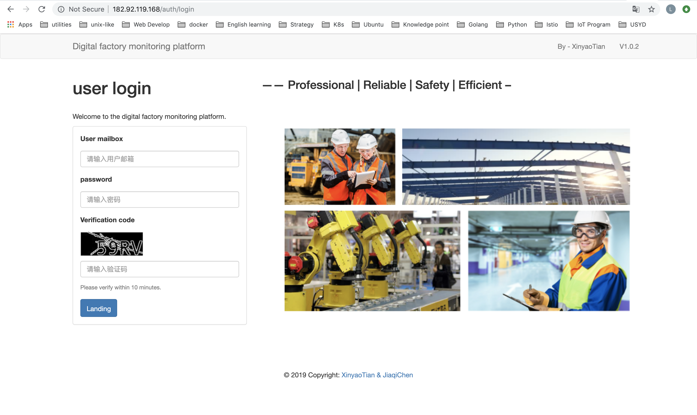
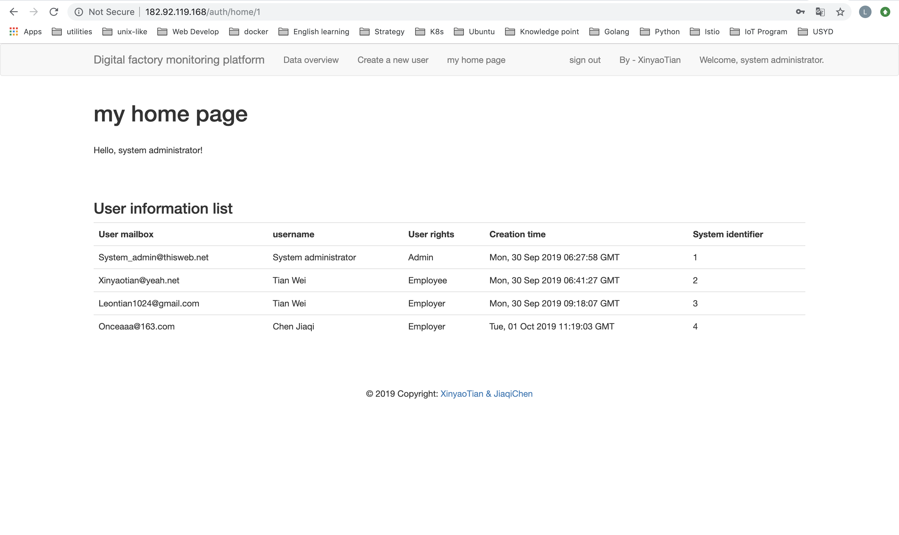
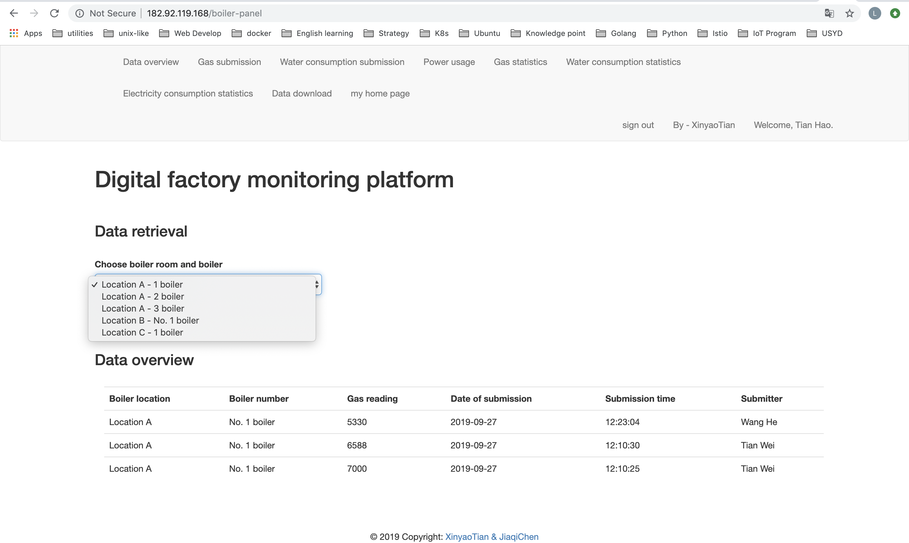
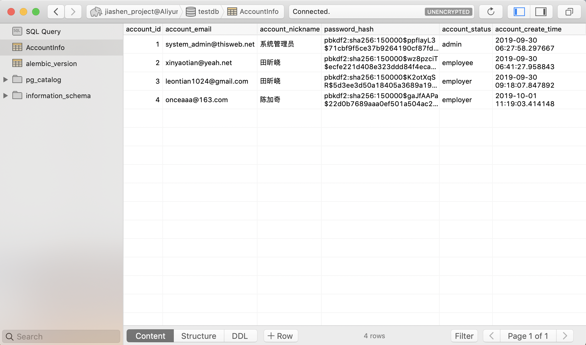

# Introduction of my Projects

## Contact Me!

- Xinyao Tian ( Richard Tian )
- mobile number(AU): (+61) 0457 512 404
- mobile number(CH): (+86) 13311369059
- Email: richardtian1024@gmail.com || leontian1024@gmail.com
- CSDN technical Blog: https://blog.csdn.net/weixin_38070561
- Zhihu technical Blog: https://www.zhihu.com/people/winchester-26/activities
- Github: https://github.com/XinyaoTian

# List of My Projects

## The Assisted Diagnosis IT System of Periodontal Disease 
(Cooperate with a Doctor from Peking University)

### Keywords
>Project keywords: BigData, Machine Learning, Information System, Web application

>Technical keywords: Zeppelin, Spark, pySpark, Flask, Linux, DevOps

### A Brief Introduction of the Project

In recent years, cross-domain research on big data has been enthusiastically sought after. 
The project was initiated by a medical doctor who studied periodontal disease at Peking University and provided more than 1.7 million (desensitized, 27 dimensions as total) true periodontal disease cases collected by clinical diagnosis in the departmental physicians during the past 20 years. 
The team I lead is responsible for the training modeling part of machine learning (including data cleaning, preprocessing, visualization, machine learning modeling, model tuning and validation, model export and persistence) Model building work and development of a Web services information system prototype with the ability to "enter new patient data and predict the severity of periodontal disease."

### Mainly Description of the Project

In terms of technical selection, I chose Zeppelin as the model training platform. With the underlying Spark and pyspark tool libraries, I can achieve excellent visualization and real-time communication and collaboration. 
Almost every time I run a model, I can immediately use Zeppelin to report the results of grid search cross-validation to Dr. Online. This frequent “report-improvement” mode can detect problems in time and make changes immediately, greatly avoiding them. The risk of “development and demand deviations are too large”. 
In terms of Web services, since it is a demo version of Demo, it has low performance requirements and clear requirements. Therefore, I chose the Python-based Flask framework, which is easy to use and speeds up the development process. The Web service implements the "new value prediction" function by calling the model trained on hdfs through pyspark.

### Project Outcomes

Design of the System Architecture

Project Show - the input web page of patients' info

Project Show - the web page of predicted results by the ML models

### Project Achievements

项目完成后，博士和公司领导对我的工作给予高度评价；我开发的 Web 服务演示版在答辩时获得了专家组老师们的青睐，有一名专家甚至多次输入了牙位点的各种数值，并将预测结果与其实际临床经验对比，发现仅有微小出入，但是系统的诊断时间只有 5 秒，是传统诊断流程所耗费时间的百分之一，于是便对本系统和机器学习模型产生了浓厚兴趣。

作为本项目的负责人，我还荣幸地成为了该博士论文的作者之一。该论文已投稿给国内某顶级医疗领域期刊，有望在明年发表。

### Project References
[Source Code of web application part](https://github.com/XinyaoTian/dentist_demo)

[Project Delivery PPT (in Chinese) ](https://github.com/XinyaoTian/project_introduction/blob/master/ppt/pku_dentist/%E5%A4%A7%E6%95%B0%E6%8D%AE%E5%AE%9E%E8%B7%B5%E8%AF%BE%E7%A8%8B%E5%B1%95%E7%A4%BA%E7%89%99%E5%91%A8%E7%97%85%E6%B2%BB%E7%96%97%E6%96%B9%E6%A1%88%E7%96%97%E6%95%88%E9%A2%84%E6%B5%8B.pptx?raw=true)

## Research Report: A Road Map to a Top Data-driven enterprise of the Year 2018
(Cooperate with the Institute of Data Science, Tsinghua University)

### Keywords

>Project Keywords: Data Analysing, Web Crawler, Data Visualization

>Technical Keywords: Scrapy, Pandas, Matplotlib, Hdfs, MongoDB

### A Brief Introduction of the Project

The project and its conference were hosted by the Institute of Data Science, Tsinghua University and co-organized by Big Data Digest. The team consists of the following four teams: the “crawler team” responsible for obtaining data, the “analysis team” responsible for analyzing the data, the author of writing articles and interviewing the “media team” of the industry’s big cattle and responsible for layout design and printing. And the "design team" of the conference. The total members of teams is up to dozens.

### Mainly Description of the Project

In this project, I also served as the main person in charge of the “Crawler Team” and the main person in charge of the “Analysis Team”. In the “Crawler Team”, since the total number of the team was as many as 13 people, in order to unify the data format and avoided excessive data confusion, I mainly undertook the work of drafting the crawler data acquisition dimension and specification to standardize the data format. To make data structure meet the release requirements; at the same time, I was also solely responsible for obtaining job information about the data positions on the Zhilian Recruitment website. In the “Analysis Team”, combined with the acquired data, I was responsible for selecting the analysis tools (using the Pandas tool library and self-packaging jieba for the team members to use quickly), organizing and coordinating the members of the analysis team, and drafting Which dimensions need to be analyzed and the purpose of the analysis is clear; at the same time, I also meet with the members of the “Design Team” several times to discuss the feasibility of the design plan and to clarify the output format of the analysis results of the “Analysis Team”.

### Project Outcomes

Cover Page of the Report

Data Analysing - in Public View: Who will be responsible for the moral problems with AI and Big Data?

Data Analysing - Comparison of the main demand of skills between Chinese universities and companies

### Project Achievements

With the efforts of all the members of the team for three consecutive weeks, the "A Road Map to a Top Data-driven enterprise of the Year 2018" was successfully released on 26th, Sep., 2018 in the lecture hall of the the Institute of Data Science, Tsinghua University. The atmosphere of the conference was warm. After the release of this report, A number of technological media immediately reprinted on the same day or the next day; it is rare for the public media of the technology circle to be so "stained" by the same report.

### Project References

[Our report on Big Data Digest](https://mp.weixin.qq.com/s/FSgPY1Q0qBtL8bJQ1GYb-A)

[The Research Report Downloading link](https://t.cj.sina.com.cn/articles/view/6105753431/16bee675701900bt98)

ps: If you're interested in content of the report, please google the keyword "2018 年度顶级数据团队建设全景报告"(in Chinese).
There are many Chinese medias reported our research.

## "DataSciCamp" A website dedicated for Data Scientists - Almost 1.5K stars in Github!
(Cooperate with a Doctor from Beijing Normal University)

### Keywords
>Project Keywords: Web Design & develop, Data Science, micro service architecture(Service Mesh)

>Technical Keywords: Flask, Docker, Kubernetes(K8S), Istio, IaaS

### A Brief Introduction of the Project

The landing product of this project is a web application for college teachers and students to obtain and share the latest competition information and share solutions.

The innovation of this project focuses on the improvement of traditional Web projects using a new software architecture called "micro service architecture".

### Mainly Description of the Project

The project was established on 29th, July, 2019.
As of 20th, September, 2019, my team and I have completed the design and implementation of most of the features of the website using the microservices architecture.
Using the microservices architecture, we not only greatly simplified the deployment and operation of the website, but also greatly reduced the cost of collaboration and greatly improved communication efficiency.
The final version of the project, "DataSciCamp 1.0", is expected to be officially launched on 1st, October, 2019. Teachers and students are welcome to enter the new version and have a new user experience.

### Project Outcomes

DataSciCamp Main Page - Older version

DataSciCamp Main Page - the Newest version

DataSciCamp - Main Contributors List

### Project Achievements

This project is an open source project on Github. To date, we have received more than 1,500 Stars and enthusiastic feedback from countless teachers, students and software developers.

### Project References

[DataSciCamp Website (the Newest version)](https://www.datascicamp.com)

[DataSciCamp Website (Older version)](https://iphysresearch.github.io/DataSciComp?sub=PF,AC,DM,CV,NLP,RL,SP)

[DataSciCamp Github Repository (Older version)](https://github.com/iphysresearch/DataSciComp)

## The Design and Implementation of a Micro-service Visualization, Operation and Monitoring System
(Internship in Institute of Software Chinese Academy of Science)

### Keywords
>Project Keywords: Basic Architecture, micro service architecture(Service Mesh), DevOps System

>Technical Keywords: IaaS, Docker, Kubernetes(K8S), Istio

### A Brief Introduction of the Project

本项目组的主要工作是基于 Kubernetes 研究及开发某互联网企业的自用云服务平台( 类似“阿里云”、“腾讯云”等 )并按时交付。作为项目组的一员，我主要负责研究“微服务架构如何应用在 Kubernetes 集群”以及设计实现 Docker 容器监控云件及模块。

### Mainly Description of the Project

在该项目的研究中，我查阅并翻译了数篇外文博客及外文开发文档，在自己得到提高的同时也为中文开发社区贡献了便利和价值( 翻译文章见: [Envoy 、 Nginx 和 HAProxy，微服务中的通信代理该如何抉择? 翻译自英文博客](https://zhuanlan.zhihu.com/p/53470343) ，首发于掘金翻译计划 )。

技术选型方面，我使用了“服务网格(  Service Mesh )”架构来代替较为流行的“ Spring Cloud 框架”进行监控模块的设计。
目前该模块的进度已经可以监测到每一个微服务之间的调用关系( 基于 Istio 的 Sidecar 模式和 L4 、 L7 代理 )，以及可视化展现多种常用监测指标( 如 CPU 利用率、网络延迟等，基于 Prometheus 和 Grafana )。

### Project Outcomes

Design of the System Architecture

Resource Monitoring Panel(Using Grafana) - Sample No.1

Resource Monitoring Panel(Using Grafana) - Sample No.2

### Project Achievements

项目负责人，中科院的博士生导师张文博教授和硕士生导师王焘教授对我的工作非常满意。

### Project References

[Github Organization of Micro service Team in ISCAS](https://github.com/iscas-microservice-team)

## The Online Factory Management System 
(for small & medium factories to manage their employees info and devices data)

### Keywords
>Project keywords: Web Application, Information System, Enterprise Software, Service Mesh

>Technical keywords: Flask, Docker, Kubernetes(K8S), Istio, PostgreSQL, MongoDB

### A Brief Introduction of the Project

This management system is developed for some small-scaled factories.
The main purpose of this system is to help the factories manage their employees, store & share enterprise data and also analyse them.
Based on the micro service architecture (which we also called 'ServiceMesh' now), each module of the whole system is running in containers.
As a result, the architecture of the system is extremely clear and the whole system is easy to iteration, highly cohesion and totally decoupling.

### Mainly Description of the Project

When developing this management system, we had a five-members team and I was the leader of the team.
As a software engineer, I deeply knew the importance of understanding the real demands of our system users.
Hence, in the first fortnight of the iteration cycle, all of team members went to the factory and worked with the workers all the days
to totally realize the situation of the factory and tried to find out what was the real demands.

Then, we tried to paint the use case diagrams, class diagrams and other diagrams(like sequence diagrams etc.) to clarify the demands.

After that, we divided the whole system to several parts and unified the REST-API between modules. We also divided our team to two groups -- 
three members for coding and two members still stayed in the factory in order to keep communication between coding group and the manager of the factory.

### Project Outcomes

The FrontPage of the System (Auto-translated by Chrome)

Project Show - the role "system administer" home page UI

Project Show - the role "employee" info-searching UI 

The Account table in PostgreSQL DB

### Project Achievements

The factory is now using our system in their daily working. The feedback from workers is pretty good.

"It's almost the most useful enterprise system I've used yet!" Said by a senior worker from that factory.

### Project References
[Source Code of web application part](https://github.com/chenjiaqi-factory-project)

[Website for demonstration (in Chinese)](http://182.92.119.168:80/)

## The End
Thanks for your reading.

